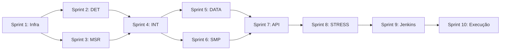

# TODO - AMD IBS Feature Testing Roadmap

## Visão Geral

Este documento organiza as tarefas para implementar o plano de testes AMD IBS (Instruction-Based Sampling) no FreeBSD, seguindo o documento **AMD IBS Feature Testing - FreeBSD Kernel**.

---

## Sprint 1: Infraestrutura Base
**Duração estimada:** 2-3 semanas

### 1.1 Estrutura de Diretórios
- [ ] Criar diretório `tests/sys/amd/ibs/`
- [ ] Criar Makefile base para testes
- [ ] Criar arquivo `ibs_utils.h` com helpers compartilhados

### 1.2 Configuração de Build
- [ ] Configurar kernel `AMD_IBS` em `sys/amd64/conf/AMD_IBS`
- [ ] Habilitar options `HWPMC_HOOKS`, `device hwpmc`, `HWPMC_AMD_IBS`
- [ ] Compilar kernel com suporte IBS

### 1.3 Ambiente de Teste
- [ ] Configurar QEMU/KVM com CPU AMD (Family 10h+)
- [ ] Instalar dependências: `kyua`, `atf-c`, `pmcstat`
- [ ] Validar que hwpmc carrega corretamente

---

## Sprint 2: Testes de Detecção de Hardware (TC-DET)
**Duração estimada:** 1 semana

### 2.1 Criar `ibs_detect_test.c`
- [ ] **TC-DET-01**: Verificar dmesg mostra IBS detectado
- [ ] **TC-DET-02**: Testar fallback em CPU sem IBS
- [ ] **TC-DET-03**: Verificar sysctl `hw.pmc.ibs_*`
- [ ] **TC-DET-04**: Validar CPUID Fn8000_001B

---

## Sprint 3: Testes de MSR Control (TC-MSR)
**Duração estimada:** 1 semana

### 3.1 Criar `ibs_msr_test.c`
- [ ] **TC-MSR-01**: Habilitar IBS fetch - verificar IBS_FETCH_CTL
- [ ] **TC-MSR-02**: Desabilitar IBS fetch
- [ ] **TC-MSR-03**: Habilitar IBS op - verificar IBS_OP_CTL
- [ ] **TC-MSR-04**: Ciclo enable/disable 100x (stress)
- [ ] **TC-MSR-05**: Testar valores mínimos/máximos de interval

---

## Sprint 4: Testes de Interrupção (TC-INT)
**Duração estimada:** 1 semana

### 4.1 Criar `ibs_interrupt_test.c`
- [ ] **TC-INT-01**: Verificar samples recebidos com workload
- [ ] **TC-INT-02**: Verificar NMI não conflita com outros NMIs
- [ ] **TC-INT-03**: IBS com kernel watchdog ativo
- [ ] **TC-INT-04**: Buffer overflow handling
- [ ] **TC-INT-05**: Stress test - taxa alta de interrupções (60s)

---

## Sprint 5: Testes de Precisão de Dados (TC-DATA)
**Duração estimada:** 1 semana

### 5.1 Criar `ibs_data_accuracy_test.c`
- [ ] **TC-DATA-01**: PC em loop conhecido
- [ ] **TC-DATA-02**: Data address em loads conhecidos
- [ ] **TC-DATA-03**: L1 cache miss flag
- [ ] **TC-DATA-04**: TLB miss flag
- [ ] **TC-DATA-05**: Branch flags e target address

---

## Sprint 6: Testes SMP (TC-SMP)
**Duração estimada:** 1 semana

### 6.1 Criar `ibs_smp_test.c`
- [ ] **TC-SMP-01**: IBS em todas CPUs simultaneamente
- [ ] **TC-SMP-02**: IBS com CPU affinity
- [ ] **TC-SMP-03**: CPU hotplug com IBS ativo
- [ ] **TC-SMP-04**: Contadores per-CPU independentes

---

## Sprint 7: Testes de API Userspace (TC-API)
**Duração estimada:** 1 semana

### 7.1 Criar `ibs_api_test.c`
- [ ] **TC-API-01**: pmcstat com IBS event
- [ ] **TC-API-02**: Dois processos abrem IBS simultaneamente
- [ ] **TC-API-03**: Usuário não-root tenta abrir IBS (EPERM)
- [ ] **TC-API-04**: ioctl PMC_OP_CONFIGURELOG com IBS

---

## Sprint 8: Testes de Estabilidade (TC-STR)
**Duração estimada:** 1-2 semanas

### 8.1 Criar `ibs_stress_test.c`
- [ ] **TC-STR-01**: IBS + memstress + cpustress (1 hora)
- [ ] **TC-STR-02**: Rapid open/close (1000 iterações)
- [ ] **TC-STR-03**: IBS em VM (graceful degradation)
- [ ] **TC-STR-04**: OOM durante sessão IBS

---

## Sprint 9: Integração Jenkins CI/CD
**Duração estimada:** 1 semana

### 9.1 Pipeline Jenkins
- [ ] Criar Jenkinsfile na raiz do projeto
- [ ] Configurar agente `freebsd-amd-ibs`
- [ ] Configurar stages: Checkout, Build, Install, Test, Report
- [ ] Configurar post-build: JUnit, artifacts, email

### 9.2 Relatórios
- [ ] Gerar JUnit XML
- [ ] Gerar HTML report via kyua
- [ ] Configurar métricas: pass rate, flaky tests

---

## Sprint 10: Execução e Validação
**Duração estimada:** Contínuo

### 10.1 Schedule de Execução
| Trigger | Tests | Frequência |
|---------|-------|------------|
| PR/Patch | TC-DET, TC-MSR, TC-INT (smoke) | A cada PR |
| Daily | Todos exceto TC-STR | Diariamente |
| Weekly | Suite completa + TC-STR | Semanalmente |
| Pre-release | Suite completa x3 | Antes de release |

---

## Dependências entre Sprints

---

## Status Atual

| Sprint | Status | Notas |
|--------|--------|-------|
| Sprint 1 | 🔴 Pending | Infraestrutura base |
| Sprint 2 | 🔴 Pending | Detecção de hardware |
| Sprint 3 | 🔴 Pending | MSR Control |
| Sprint 4 | 🔴 Pending | Interrupts |
| Sprint 5 | 🔴 Pending | Precisão de dados |
| Sprint 6 | 🔴 Pending | SMP |
| Sprint 7 | 🔴 Pending | API Userspace |
| Sprint 8 | 🔴 Pending | Estabilidade |
| Sprint 9 | 🔴 Pending | Jenkins CI/CD |
| Sprint 10 | 🔴 Pending | Execução |

---

## Referências

- [AMD IBS Feature Testing Document](./docs/AMD_IBS_Feature_Testing.md)
- FreeBSD hwpmc(4): https://man.freebsd.org/hwpmc
- AMD APM Volume 2: Instruction-Based Sampling
- FreeBSD ATF: https://github.com/jmmv/atf
- Kyua: https://github.com/jmmv/kyua
